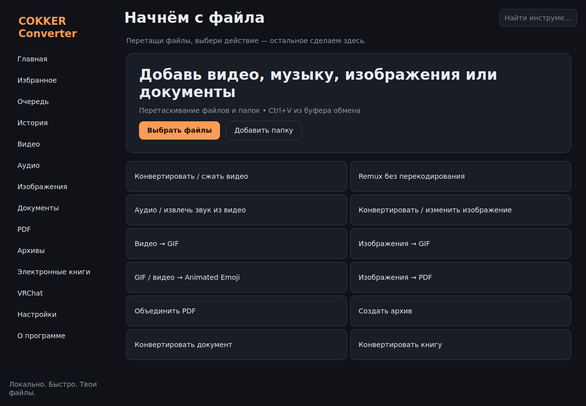

# COKKER Converter

Локальный конвертер файлов для Windows 10/11 x64. Русский интерфейс, очередь задач, drag & drop, буфер обмена, экспорт результатов перетаскиванием, история, пресеты JSON, трей и автозагрузка. **Предварительная версия 0.9.1.**



После добавления файла список действий подстраивается под его тип. Например, для PNG доступны преобразование изображения, PDF из изображения и создание архива. Для набора разных типов остаются только общие операции. Тип PNG, GIF, JPEG, PDF и ZIP также определяется по содержимому. Разделы имеют иконки, окно и установщик — логотип с драконом. Плавные переходы можно отключить в настройках.

## Возможности

- Видео: FFmpeg конвертирует, сжимает, меняет размер/FPS/скорость, обрезает временной диапазон, кадрирует, поворачивает, отражает, удаляет/заменяет аудио, добавляет/удаляет/встраивает субтитры, remux и объединение совместимых роликов.
- Аудио: извлечение из видео, конвертация, временная обрезка, скорость, громкость, нормализация, объединение.
- Изображения: PNG, JPEG, WebP, AVIF, BMP, GIF, TIFF, ICO и HEIC/HEIF при установленном `pillow-heif`; изменение размера, crop, поворот, отражение, сжатие до лимита с проверкой.
- Анимация: видео → GIF, изображения → GIF, VRChat Animated Emoji spritesheet 1024×1024 (4/16/64 кадров). PNG загружается вручную через сайт VRChat; приложение не выполняет вход или загрузку в аккаунт.
- PDF: изображения → PDF, PDF → PNG в ZIP, объединение, выбор/поворот страниц и оптимизация потоков. Защищённые PDF не поддерживаются.
- Архивы: создание ZIP/TAR и извлечение ZIP/TAR с проверкой путей.
- Документы и книги: при отдельно установленном LibreOffice/Calibre, если конкретная пара форматов поддерживается этими программами.
- Очередь SQLite с восстановлением, отменой активной задачи, сравнением размеров и историей. Оригинал сохраняется, готовый файл проверяется.

## Установка и запуск

Скачайте Windows Portable или Setup из [Releases](https://github.com/cokker/COKKER-Converter/releases). При запуске из исходников установите Python 3.12+ и выполните:

```powershell
py -3.12 -m venv .venv
.venv\Scripts\python.exe -m pip install -r requirements.txt
.venv\Scripts\python.exe main.py
```

Для видео установите FFmpeg и ffprobe в `PATH` или положите официальные бинарники в `components` рядом с EXE. Для документов установите LibreOffice, для книг Calibre. Настройки → Компоненты показывает найденные программы. В portable-версии параметры хранятся в `data` рядом с EXE; обычная версия использует `%LOCALAPPDATA%\COKKER Converter`.

## Быстрый сценарий

Добавьте файл перетаскиванием или через кнопку: подходящие действия выберутся автоматически. Укажите действие и формат, затем добавьте в очередь. Дополнительные настройки раскрываются отдельно. Готовый файл можно открыть, скопировать или перетащить из очереди в другое приложение. Одинаковые файлы никогда не перезаписываются.

## Пресеты и конфиденциальность

Создайте пресет рядом с кнопкой старта. Экспорт и импорт всех пресетов в JSON доступны в «Избранном»; в JSON не включаются абсолютные пути, токены и пароли. Файлы пользователя обрабатываются локально. Только явная проверка обновления обращается к GitHub. Для VRChat PNG создаётся локально, дальнейшая загрузка выполняется пользователем на сайте VRChat.

## Ограничения предварительной версии

Прямой вход и загрузка Emoji в VRChat, визуальная шкала видео, интерактивное сравнение до/после, GPU-проверка перед кодированием, 7z, автоматическая установка компонентов, сортировка избранного между перезапусками, обновление внутри приложения и отдельные локализации не реализованы. Видео concat требует одинаковых параметров. Оценка целевого размера видео не гарантирует точный предел. Быстрый remux и обрезка зависят от ключевых кадров. Некоторые форматы зависят от установленного FFmpeg. GIF из изображений сохраняет заданный размер первого кадра.

## Сборка, FAQ и планы

`.github/workflows/windows.yml` проверяет тесты и собирает Windows x64, Portable и установщик Inno Setup. Для ручной сборки см. [инструкцию](docs/BUILD.md). Вопрос «Где мои файлы?» — выбранная папка результата, по умолчанию `Видео/COKKER`. «Почему документ не конвертируется?» — установите LibreOffice и выберите формат, который он поддерживает для данного документа. «Почему MKV не remux в MP4?» — кодеки не подходят контейнеру, используйте видеоконвертацию.

Планы на следующие версии: полноценный редактор временной шкалы, точная оценка целевого размера, просмотр до/после, локализация EN, экспорт отдельных пресетов, более широкий набор PDF-операций и загрузка VRChat после отдельной проверки API и безопасного хранения сессии.

MIT License. FFmpeg, LibreOffice, Calibre и Inno Setup распространяются отдельно на условиях своих лицензий. Код VRCEmoji не включён.
